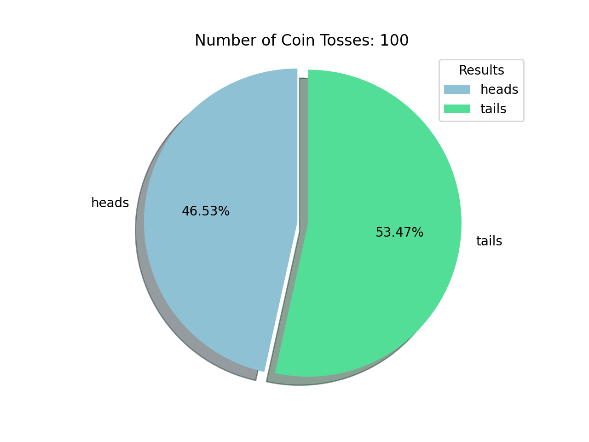
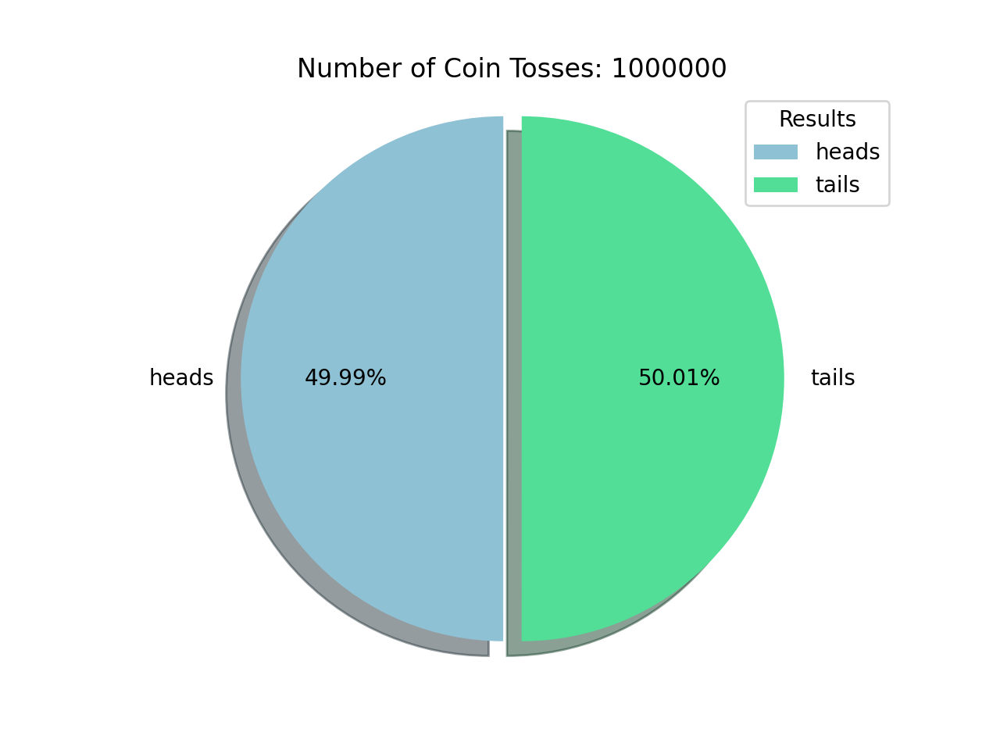

Law of Large Numbers ⚖️
=========================================

Overview
-----------------

In probability theory, the law of large numbers (LLN) is a theorem that describes the result of performing the same experiment a large number of times. According to the law, the average of the results obtained from a large number of trials should be close to the expected value and will tend to become closer to the expected value as more trials are performed.(<a href="https://en.wikipedia.org/wiki/Law_of_large_numbers#cite_note-:0-1">Wikki</a>)

 

User input
------------------------------------
1. enter the number of randomized coin tosses

 

Output
----------------
1. gives number of heads
2. gives number of tails
3. The script will also auto generate a graph, that shows the results

 

Experiment #1
------------------------------

<h3>Coin tossess: <u>100</u></h3>

 

<h3>Results</h3>

<code>
Count of tails: 54  
Count of heads: 47  

Tails: 50.07%  
Heads: 49.93%  
</code>

 
<i>Auto generated graph</i>
 

 

Experiment #2
------------------------------

<h3>Coin tossess: <u>1 Million</u></h3>

 

<h3>Results</h3>

<code>
Count of tails: 500,056  
Count of heads: 499,945  

Tails: 50.07%  
Heads: 49.93%  
</code>

 
 

